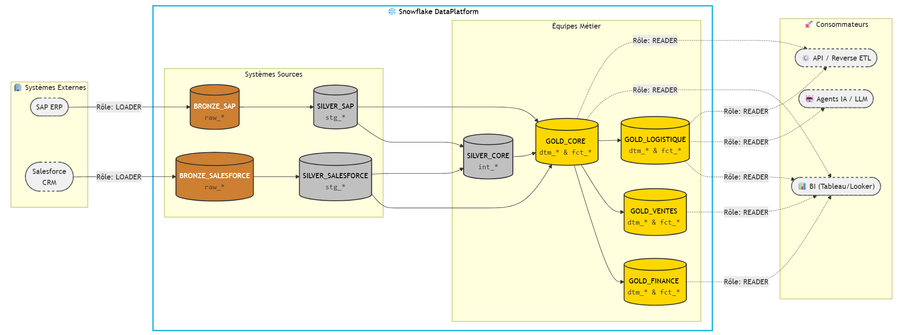
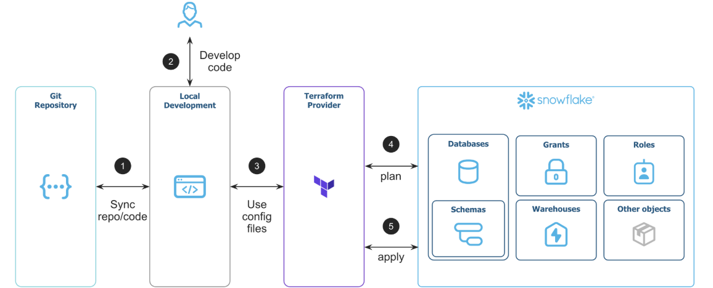
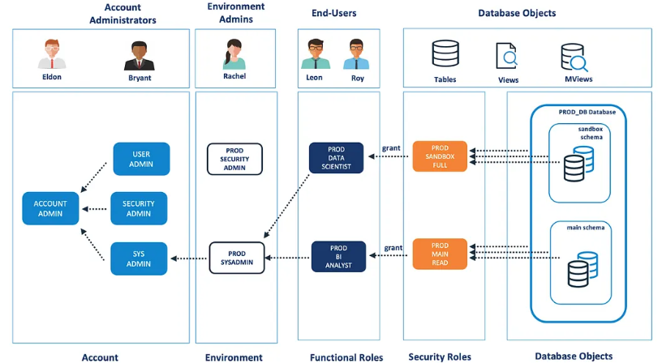

# ❄️ Snowflake DCM - RBAC & Architecture

Projet exploratoire sur **Snowflake DCM (Declarative Configuration Management)** pour la gestion des accès (RBAC) et définition as code du terrain de jeu dans lequel raffiner vos données.

---

## 🏗️ Architecture déployée

L'architecture de ce projet s'articule autour de rôles fonctionnels clairs et d'une organisation des données en couches (Medallion Architecture).



### 👥 Rôles fonctionnels (personas)

La hiérarchie des rôles est standardisée (cf. `setup.sql`) :

* **`LOADER`** : Chargé de l'ingestion des données brutes depuis les sources. Il possède les droits d'écriture sur les couches Bronze (et la création de stages/pipes).
* **`TRANSFORMER`** : Chargé de la modélisation (ex: dbt). Il lit le Bronze et écrit dans les couches Silver et Gold.
* **`READER`** : Rôle global (ou décliné par équipe métier) pour les utilisateurs finaux ou outils de BI. Il consomme la donnée valorisée en lecture seule.

### 🗂️ Organisation des données

La donnée est dynamiquement séparée en deux grands domaines via Jinja :

1. **Systèmes Sources (`BRONZE_*` / `SILVER_*`)** : Données alignées sur les systèmes d'origine (ex: `SAP`, `SALESFORCE`).
* `BRONZE_<source>` : Données brutes telles qu'ingérées.
* `SILVER_<source>` : Données nettoyées, castées et standardisées.

2. **Équipes Métier (`SILVER_*` / `GOLD_*`)** : Données alignées sur les domaines de l'entreprise (ex: `FINANCE`, `MARKETING`).
* `SILVER_<team>` : Données intermédiaires, jointes et dédoublonnées.
* `GOLD_<team>` : Datamarts finaux (Dimensions et Faits) prêts à l'emploi.

---

## 🔄 Contexte : l'évolution du RBAC avec Snowflake

1. Actions **clic-bouton** dans l'UI ou scripts éparse, **rarement versionnés** et souvent en désynchronisé de l'existant.
2. **Terraform** : l'outil de référence pour la gestion d'infrastructure as code (**IaC**).\
  Snowflake a repris la main du provider dédié en 2025 avec une [v2](https://github.com/snowflakedb/terraform-provider-snowflake), mais est encore annoncée en GA.\
  Les équipes doivent alors prendre le plis de cet outil (mapping, foreach, toSet, locals) pour bien implémenter son infra.\
  ✍️ Snowflake guide [Terraforming Snowflake](https://www.snowflake.com/en/developers/guides/terraforming-snowflake/)\
  
1. **[Permifrost](https://gitlab.com/gitlab-data/permifrost/)** (2021) : outil tiers en Python pour gérer le RBAC via  `yaml`. C'était une option intéressante, bien que moins connue dans la communauté.\
  ✍️ [article medium](https://medium.com/yousign-engineering-product/snowflake-rbac-implementation-with-permifrost-3d30652825ad) - nov 2022 par Pascal Moreau\
  
1. **➡️ Snowflake DCM** (2026) : La nouvelle solution native, déclarative as-code et accessible de par les languages employés (`yaml` & `sql`). Elle permet de déclarer son infrastructure et ses accès via des fichiers en y mêlant du **Jinja** (comme dans dbt).


## ⚖️ Vision : qui fait quoi ?

DCM est très puissant et pourrait théoriquement tout faire (y compris créer des tables). Cependant, pour garder une stack maintenable, notre vision est de séparer strictement la gestion du "terrain de jeu" (db, schema, wh, role) de la gestion de la donnée elle-même.

| Domaine | Outil Recommandé | Rôle |
| --- | --- | --- |
| **Infra, Sécurité & RBAC** | `Snowflake DCM` | Définition du terrain de jeu : création des Warehouses, Databases, Schémas, Rôles et gouvernance globale via les droits d'accès. |
| **Assets Data** | `dbt` | Création, transformation et cycle de vie des objets contenant la donnée au sein des schémas (Tables, Views, Materialized Views). |

> **💡 Règle d'or :** Snowflake DCM délimite le terrain de jeu, construit les murs et distribue les clés. `dbt` fabrique et agence les meubles. C'est pour cela que DCM ne crée aucune table, mais délègue le `GRANT CREATE TABLE` au rôle `TRANSFORMER`.

---

## 📂 Anatomie du projet

La force de ce projet réside dans son aspect "DRY" (Don't Repeat Yourself) grâce à Jinja.

* **`manifest.yml`** : Le cœur du réacteur. Il définit les environnements (`DEV`, `PROD`) et injecte les variables (listes des sources, listes des équipes).
* **`sources/definitions/setup.sql`** : Le point d'entrée. Il boucle sur les variables du manifest pour créer à la volée tous les schémas et rôles nécessaires.
* **`sources/macros/`** :
  * `helpers_grants.sql` : Standardise la façon de donner les droits de lecture (`GRANT SELECT ON FUTURE...`) et d'écriture.
  * `setup_source_layer.sql` & `setup_team_layer.sql` : Macros qui appliquent la logique métier pour chaque source ou équipe générée.
* **`init_role_dcm_deployer.sql`** : Script d'amorçage.
  * Création d'un rôle dcm_deployer recoupant les mandats des rôles snowflake `sysadmin` & `securityadmin`.
  * Création d'un schéma infra.rbac_dcm hébergeant nos déploiements dcm.

---

## 🚀 Quickstart / déploiement

### Étape 1 : Amorçage de la sécurité (une seule fois)

Avant de lancer DCM, il faut créer un rôle dédié au déploiement (`DCM_DEPLOYER`), qui aura le privilège `MANAGE GRANTS` et les droits de créer les objets de haut niveau.
Exécutez le script `init_role_dcm_deployer.sql` dans Snowflake avec le rôle `ACCOUNTADMIN`.

### Étape 2 : Déploiement

#### via l'UI Snowflake

Depuis les workspaces Snowflake, on peut créer un projet DCM. Le mieux étant bien sûr de passer par git dans snowflake :). Cela ne ferait pas sérieux de ne pas versionner son IaC.

#### via la CLI Snowflake

Une fois le rôle de déploiement en place, utilisez la CLI native de Snowflake depuis votre terminal :

```bash
# 1. Créer l'objet projet dans Snowflake (à faire une fois par environnement)
snow dcm create BONCO_INFRA --if-not-exists --target DEV

# 2. Prévisualiser les changements (Dry Run / Plan)
snow dcm plan --target DEV

# 3. Appliquer les changements sur le compte Snowflake
snow dcm deploy --target DEV
```
