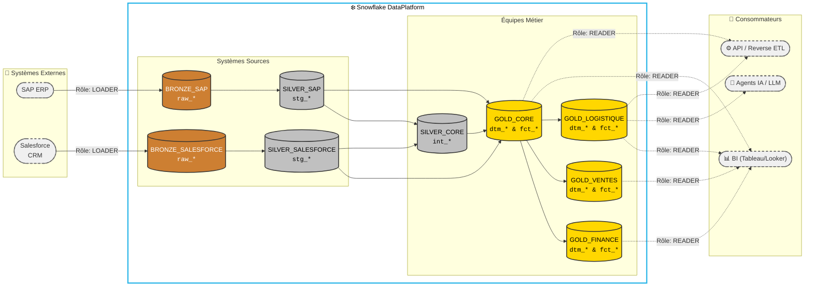

## 🏗️ Architecture déployée

```mermaid
flowchart LR
    %% Définition des styles (Couleurs Snowflake et Médaillon)
    classDef bronze fill:#cd7f32,stroke:#333,stroke-width:2px,color:#fff;
    classDef silver fill:#c0c0c0,stroke:#333,stroke-width:2px,color:#000;
    classDef gold fill:#ffd700,stroke:#333,stroke-width:2px,color:#000;
    classDef table fill:#f9f9f9,stroke:#005c9e,stroke-width:1px,color:#000,shape:rect;
    classDef external fill:#f0f0f0,stroke:#666,stroke-width:2px,stroke-dasharray: 5 5;

    %% ==========================================
    %% 1. SYSTEMES SOURCES (À GAUCHE)
    %% ==========================================
    subgraph EXT_SRC [🏢 Systèmes Externes]
        direction TB
        SAP_EXT(["SAP ERP"]):::external
        SF_EXT(["Salesforce<br>CRM"]):::external
    end

    %% ==========================================
    %% 2. TERRAIN DE JEU SNOWFLAKE (AU CENTRE)
    %% ==========================================
    subgraph SNOWFLAKE [❄️ Snowflake DataPlatform]
        direction LR

        subgraph SOURCES [Systèmes Sources]
            direction LR

            B_SAP[("BRONZE_SAP<br><code>raw_*</code>")]:::bronze ---> S_SAP[("SILVER_SAP<br><code>stg_*</code>")]:::silver

            B_SF[("BRONZE_SALESFORCE<br><code>raw_*</code>")]:::bronze ---> S_SF[("SILVER_SALESFORCE<br><code>stg_*</code>")]:::silver
        end

        subgraph METIER [Équipes Métier]
            S_CORE[("SILVER_CORE<br><code>int_*</code>")]:::silver
            G_CORE[("GOLD_CORE<br><code>dtm_* & fct_*</code>")]:::gold

            S_SF ----> G_CORE
            S_SF ----> S_CORE
            S_SAP ----> S_CORE
            S_SAP ----> G_CORE
            S_CORE --> G_CORE

            G_LOG[("GOLD_LOGISTIQUE<br><code>dtm_* & fct_*</code>")]:::gold

            G_VEN[("GOLD_VENTES<br><code>dtm_* & fct_*</code>")]:::gold

            G_FIN[("GOLD_FINANCE<br><code>dtm_* & fct_*</code>")]:::gold

            G_CORE --> G_FIN
            G_CORE --> G_VEN
            G_CORE --> G_LOG
        end

    end

    %% ==========================================
    %% 3. CONSOMMATEURS (À DROITE)
    %% ==========================================
    subgraph EXT_CONS [🚀 Consommateurs]
        direction TB
        BI(["📊 BI (Tableau/Looker)"]):::external
        API(["⚙️ API / Reverse ETL"]):::external
        AI(["🤖 Agents IA / LLM"]):::external
    end

    %% ==========================================
    %% CONNEXIONS INGESTION & CONSOMMATION
    %% ==========================================

    %% Ingestion
    SAP_EXT -- "Rôle: LOADER" --> B_SAP
    SF_EXT -- "Rôle: LOADER" --> B_SF

    %% Consommation
    G_FIN -. "Rôle: READER" .-> BI
    G_LOG -. "Rôle: READER" .-> BI
    G_VEN -. "Rôle: READER" .-> BI
    G_LOG -. "Rôle: READER" .-> AI
    G_CORE -. "Rôle: READER" .-> BI
    G_CORE -. "Rôle: READER" .-> API
    G_LOG -. "Rôle: READER" .-> API

    %% ==========================================
    %% APPLICATION DES STYLES SPECIFIQUES
    %% ==========================================
    %% Style de la grande boîte Snowflake (Blanc bord bleu clair)
    style SNOWFLAKE fill:#ffffff,stroke:#29b5e8,stroke-width:3px,color:#000

    %% Styles des schémas (Médaillon en pointillé)
    style B_SAP fill:#cd7f32,stroke:#333,stroke-width:2px,color:#fff
    style S_SAP fill:#c0c0c0,stroke:#333,stroke-width:2px,color:#000
    style B_SF fill:#cd7f32,stroke:#333,stroke-width:2px,color:#fff
    style S_SF fill:#c0c0c0,stroke:#333,stroke-width:2px,color:#000
    style G_LOG fill:#ffd700,stroke:#333,stroke-width:2px,color:#000
```